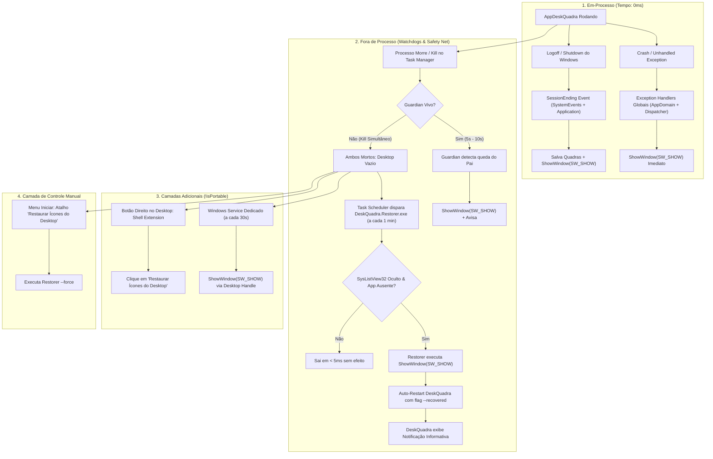

# Plano — Resiliência de Desktop, Boot Seguro & Safety Net — DeskQuadra

> **LEITURA OBRIGATÓRIA ANTES DE QUALQUER LINHA DE CÓDIGO:**
> 1. Leia obrigatoriamente `docs/BRAINSTORMING.md` (com foco especial nas Sessões 1, 13, 28 e 29) e respeite rigorosamente todas as decisões estratégicas e regras arquiteturais já consolidadas.
> 2. Consulte e siga as regras de engenharia em `docs/PLANO_DE_IMPLEMENTACAO.md` e a auditoria viva em `docs/AUDITORIA_REUSO.md`.
> 3. **Uso Mandatório das Skills:** Utilize ativamente as skills especializadas disponíveis no diretório `.agent/skills/` deste repositório para guiar cada etapa de código, revisão, interop Win32, testes e documentação.

---

## 1. Objetivo & Diagnóstico do Problema

### O Problema Diagnosticado
Anteriormente, caso o usuário instalasse o DeskQuadra, utilizasse no dia a dia e desligasse o computador (ou se o processo fosse encerrado inesperadamente), no boot seguinte o desktop do Windows podia aparecer completamente vazio (ícones nativos ocultos). O usuário, muitas vezes com pressa para abrir um aplicativo antes do carregamento completo do sistema ou em máquinas mais lentas, ficava incapacitado de ver ou interagir com seus arquivos da área de trabalho até que o processo do DeskQuadra entrasse em execução e desenhasse as Quadras.

Pior ainda: no cenário catastrófico em que o usuário (ou uma ferramenta externa) abrisse o Gerenciador de Tarefas do Windows e finalizasse **tanto o `DeskQuadra.exe` quanto o `DeskQuadra.Guardian.exe` simultaneamente**, os handlers em memória não chegavam a rodar, o Guardian morria antes de agir e o usuário ficava com a área de trabalho vazia sem saber como recuperar seus ícones.

### A Mudança de Paradigma (O Paradigma do Desktop Seguro)
O DeskQuadra adota a mesma premissa de confiabilidade do Windows Shell:
1. **No Boot do Windows:** O Explorer SEMPRE inicia com os ícones visíveis por padrão (`HideIcons = 0`, `SysListView32` visível). O usuário pode clicar e abrir qualquer atalho imediatamente.
2. **Ao Carregar o DeskQuadra:** O aplicativo carrega suavemente, oculta os ícones nativos via Win32 `ShowWindow(SW_HIDE)` na memória de janelas e renderiza as Quadras organizadas.
3. **Ao Encerrar (Qualquer Motivo):** Seja saída graciosa ("Sair" na bandeja), logoff/shutdown do Windows, crash inesperado ou kill forçado, a visibilidade nativa dos ícones do desktop **DEVE ser restaurada instantaneamente** via Win32 `ShowWindow(SW_SHOW)`.
4. **Proibição Estrita no Registro:** É expressamente **PROIBIDO** persistir `HideIcons = 1` no registro do Windows (`HKCU\Software\Microsoft\Windows\CurrentVersion\Explorer\Advanced\HideIcons`). O DeskQuadra sempre sanitiza e assegura que o registro permaneça com `HideIcons = 0`.
5. **No Próximo Boot:** O desktop sempre acorda com seus ícones visíveis. O usuário **NUNCA** fica refém de uma tela vazia.

### Esclarecimento Arquitetural: Registro do Windows vs. Ocultação em Memória (Volátil)
- **Por que falamos de "não ter persistência de ícones escondidos"?**
  - No Windows Explorer, a opção "Mostrar ícones da área de trabalho" do menu de contexto nativo grava `HideIcons = 1` em `HKCU\Software\Microsoft\Windows\CurrentVersion\Explorer\Advanced\HideIcons`. Essa chave é uma persistência do sistema: se gravada como `1`, toda vez que o Windows liga, o Explorer lê o registro e omite os ícones desde o boot.
  - O DeskQuadra **NUNCA usa essa chave para esconder ícones**. Pelo contrário: ele assegura que essa chave esteja sempre em `0` (visível).
- **Como o DeskQuadra esconde os ícones sem persistir?**
  - A ocultação é feita exclusivamente em **tempo de execução (em memória RAM)** via API Win32: `ShowWindow(hDesktopListView, SW_HIDE)`.
  - Esta alteração afeta apenas a janela em exibição no momento. Ela **não grava nada em disco nem no registro**.
  - Quando o Windows é desligado ou reiniciado, a memória é reciclada. No boot seguinte, o Explorer cria uma nova janela de desktop do zero e, como o registro está intacto (`HideIcons = 0`), os ícones nascem **100% visíveis por padrão**.
  - O DeskQuadra só armazena em disco o arquivo `quadras.json` (layout de posições, cores e itens das Quadras). O estado de "ícones ocultos" é estritamente volátil.


---

## 2. Regras Permanentes do Projeto (Valem para Todas as Fases)

- **Clean-Room Design:** Terminologia estritamente proprietária: **"Quadra"**. Tolerância zero para nomes ou marcas de softwares concorrentes comerciais no código-fonte, nomes de arquivos, testes ou documentação.
- **Stack & Eficiência:** C# / .NET 8 LTS + WPF. Alocação de memória restrita (~30MB RAM base), sem dependências pesadas externas e sem engines Chromium/WebView2.
- **Clean Architecture & Isolamento:**
  - `Core`: Lógica de domínio pura e contratos.
  - `Application`: Orquestração de casos de uso e serviços.
  - `Infrastructure.WindowsShell`: Todo P/Invoke Win32 (`user32.dll`, `kernel32.dll`, `TaskScheduler`, `WorkerW`).
  - `Infrastructure.Persistence`: Armazenamento de configurações e logs de diagnóstico.
  - `UI.Wpf`: Telas, viewmodels, estilos e feedback ao usuário.
- **Idioma & Localização:** Todo texto visível ao usuário final deve residir obrigatoriamente em `Strings.resx` (pt-BR default). Proibido texto hardcoded visível em C#/XAML. Logs de diagnóstico técnicos internos permanecem no molde padrão (`safety-restore.log` em `%APPDATA%\DeskQuadra`).
- **Filosofia de Reuso:** Se já existe uma implementação estável (`NativeDesktopIconService`, `NativeMethods`, etc.), REUSE. Extrair helper/serviço compartilhado na 2ª repetição, nunca antes.

---

## 3. Matriz de Skills Mandatórias por Fase (`.agent/skills/`)

Conforme a governança de engenharia estabelecida na Sessão 1 do `docs/BRAINSTORMING.md`, o desenvolvimento de cada fase deve ser guiado pelas skills do repositório:

| Fase | Foco Técnico | Skills Obrigatórias |
|---|---|---|
| **Fase 1** | Handlers de término, `SessionEnding`, sanitização de registro e proteção de SafeMode | `dotnet-pinvoke`, `wpf-windows-desktop`, `coding-guidelines`, `csharp-refactoring`, `run-tests` |
| **Fase 2** | Novo executável leve `DeskQuadra.Restorer`, auto-restart com notificação e atalho Menu Iniciar | `dotnet-pinvoke`, `msbuild-modernization`, `coding-guidelines`, `csharp-refactoring`, `run-tests`, `assertion-quality` |
| **Fase 3** | Windows Task Scheduler Safety Net (verificação a cada 1 min) | `dotnet-pinvoke`, `wpf-windows-desktop`, `analyzing-dotnet-performance`, `coding-guidelines` |
| **Fase 4** | Windows Service dedicado (30s) e Shell Extension de contexto para instalação completa (`!isPortable`) | `dotnet-pinvoke`, `msbuild-modernization`, `coding-guidelines`, `docs-writer` |

---

## 4. Arquitetura de Defesa em Profundidade (As Camadas de Proteção)

Para garantir que o desktop nunca fique vazio sob hipótese alguma, o DeskQuadra opera com múltiplas camadas complementares:



### Detalhamento das Camadas e Decisões Tomadas:
1. **Camada 1 — Exception Handlers (0ms):** Invocação de método estático seguro `NativeDesktopIconService.EmergencyRestoreIcons()` em `AppDomain.CurrentDomain.UnhandledException` e `DispatcherUnhandledException`, sem depender de instâncias de DI que possam ser nulas.
2. **Camada 2 — Evento `SessionEnding` (0ms):** Captura tanto no `System.Windows.Application.SessionEnding` quanto em `Microsoft.Win32.SystemEvents.SessionEnding`. Salva as Quadras ativas e restaura imediatamente os ícones nativos antes que o Windows encerre o subsistema de janelas.
3. **Camada 3 — Processo Guardião (`DeskQuadra.Guardian`, 5-10s):** Monitora o PID do processo pai. Se o processo pai for encerrado abruptamente, restaura os ícones. Atalho de emergência `Ctrl + Shift + Alt + Q` existente mantido.
4. **Camada 4 — Windows Service Dedicado (30s) [Opção A confirmada para `!isPortable`]:** Serviço nativo leve do Windows que verifica a cada 30 segundos se nenhum processo do DeskQuadra está rodando com ícones invisíveis. Presente apenas na instalação completa (`!isPortable`).
5. **Camada 5 — Task Scheduler Safety Net (1 min) + `DeskQuadra.Restorer.exe` [Opção A + Opção B confirmadas]:**
   - Agendamento nativo a cada 1 minuto (Opção 3 confirmada: 1 min).
   - Executa `DeskQuadra.Restorer.exe` (executável leve C# de ~25KB, sem dependência de script PowerShell que possa ser bloqueado por antivírus ou política de execução).
   - Comportamento de Recuperação (Opção B confirmada): O Restorer restaura os ícones e reinicia o `DeskQuadra.exe` automaticamente com a flag `--recovered`. Ao subir, o app exibe uma notificação/toast informativa explicando a recuperação.
6. **Camada 6 — Atalho no Menu Iniciar:** Criado em `%APPDATA%\Microsoft\Windows\Start Menu\Programs\DeskQuadra\Restaurar Ícones do Desktop.lnk`, permitindo ao usuário abrir o Menu Iniciar, digitar "restaurar" e recuperar seus ícones instantaneamente.
7. **Camada 7 — Shell Extension no Menu de Contexto [Confirmado para `!isPortable`]:** Opção no clique com botão direito no papel de parede: "Restaurar Ícones do Desktop (DeskQuadra)".
8. **Camada 8 — Detecção de Modo Seguro (`SafeMode`):** Se o Windows iniciar em Modo Seguro (`SystemInformation.BootMode != Normal`), restaura os ícones, exibe aviso informativo e encerra imediatamente sem subir o app completo.
9. **Camada 9 — Sanitização de Registro & Boot Forçado:** Verificação contínua para assegurar que `HideIcons` seja sempre `0` no registro e tratamento de reinício pós-queda de energia.

---

## 5. Fases de Execução Testáveis pelo PO (Goal-Driven)

As entregas estão estruturadas em fatias verticais coesas, permitindo que o PO teste cenários reais no Windows ao final de cada fase, sem sobrecarga de validações intermediárias minúsculas.

---

### Fase 1 — Núcleo de Resiliência no Ciclo de Vida do App
**Objetivo:** Blindar o processo principal contra crashes, desligamentos e estados inconsistentes do registro, garantindo que o app nunca deixe os ícones ocultos ao sair de forma graciosa ou com falha.

#### O que será feito:
1. **Método Estático de Emergência:** Criar `NativeDesktopIconService.EmergencyRestoreIcons()` totalmente estático e thread-safe, com busca direta dos handles Win32 `SHELLDLL_DefView` e `SysListView32` e chamada `ShowWindow(SW_SHOW)`, sem depender de instâncias ou DI.
2. **Handlers Globais Robustos:** Conectar `AppDomain.CurrentDomain.UnhandledException` e `DispatcherUnhandledException` diretamente ao método estático de emergência.
3. **Tratamento de `SessionEnding`:**
   - Adicionar subscrição em `SystemEvents.SessionEnding` e override de `Application.OnSessionEnding`.
   - Executar persistência rápida de layout (`SaveNowAsync`) e restauração imediata dos ícones nativos (`ShowWindow(SW_SHOW)`).
4. **Proteção de Modo Seguro (`SafeModeGuard`):**
   - No início de `Program.Main`, verificar `SystemInformation.BootMode`.
   - Se diferente de `Normal`, chamar restauração estática dos ícones, exibir mensagem informativa leve e sair (`return`) antes de inicializar o WPF.
5. **Sanitização da Chave de Registro `HideIcons`:**
   - Assegurar que nenhuma rotina grave `HideIcons = 1` no registro.
   - Criar rotina de sanitização na inicialização e no encerramento que garante `HideIcons = 0` em `HKCU\Software\Microsoft\Windows\CurrentVersion\Explorer\Advanced`.
6. **Detecção de Desligamento Forçado / Queda de Energia:**
   - Gravar timestamp de saída graciosa em `%APPDATA%\DeskQuadra\last_shutdown.timestamp`.
   - Se no boot o tempo decorrido desde o último boot do Windows indicar shutdown abrupto (sem timestamp de saída limpa), garantir que a janela nativa de ícones seja forçada para visível antes de reconfigurar o desktop.

#### Critério de Aceite do PO & Roteiro Prático de Testes:
- `dotnet test` passando 100% verde e zero avisos de compilação.

##### Roteiro de Testes da Fase 1:
1. **Teste 1 (Saída Graciosa / Bandeja):**
   - *Procedimento:* Iniciar o DeskQuadra. Verificar que as Quadras abrem e os ícones nativos somem. Clicar com o botão direito no ícone da bandeja (System Tray) e selecionar **"Sair"**.
   - *Resultado esperado:* As janelas de Quadras fecham e os ícones originais do Windows reaparecem instantaneamente (< 50ms).
2. **Teste 2 (Simulação de Crash - Exception Handler):**
   - *Script Auxiliar:* `tests/helpers/test-crash.cmd`:
     ```cmd
     @echo off
     echo Disparando crash intencional no DeskQuadra...
     dotnet run --project src/DeskQuadra.UI.Wpf -- --crash-test
     ```
   - *Procedimento:* Executar `tests/helpers/test-crash.cmd`. O app forçará uma exceção não tratada na UI thread.
   - *Resultado esperado:* O handler estático `EmergencyRestoreIcons()` captura a falha e os ícones nativos reaparecem imediatamente no desktop antes do processo ser finalizado.
3. **Teste 3 (Simulação de Logoff / Shutdown - `SessionEnding`):**
   - *Script Auxiliar:* `tests/helpers/test-session-ending.ps1`:
     ```powershell
     # Envia WM_QUERYENDSESSION para a janela principal do DeskQuadra sem deslogar o PC
     $hwnd = (Get-Process -Name "DeskQuadra.UI.Wpf" -ErrorAction SilentlyContinue).MainWindowHandle
     if ($hwnd) {
         Add-Type @"
             using System;
             using System.Runtime.InteropServices;
             public class Win32 {
                 [DllImport("user32.dll")] public static extern IntPtr SendMessage(IntPtr hWnd, uint Msg, IntPtr wParam, IntPtr lParam);
             }
"@
         [Win32]::SendMessage($hwnd, 0x0011, [IntPtr]::Zero, [IntPtr]::Zero) # WM_QUERYENDSESSION
         Write-Host "Sinal de encerramento de sessao enviado."
     }
     ```
   - *Resultado esperado:* O DeskQuadra salva o estado em `quadras.json` e chama `ShowWindow(SW_SHOW)`.
4. **Teste 4 (Sanitização do Registro do Windows):**
   - *Script Auxiliar:* `tests/helpers/check-registry.cmd`:
     ```cmd
     @echo off
     powershell -Command "Get-ItemProperty -Path 'HKCU:\Software\Microsoft\Windows\CurrentVersion\Explorer\Advanced' -Name 'HideIcons' | Select-Object HideIcons"
     ```
   - *Resultado esperado:* O valor `HideIcons` retornado deve ser rigorosamente `0`.

---

### Fase 2 — Executável Dedicado `DeskQuadra.Restorer` & Atalho no Menu Iniciar
**Objetivo:** Criar o módulo executável dedicado e independente para restauração emergencial e auto-recuperação do app, acompanhado de atalho de fácil acesso no Menu Iniciar.

#### O que será feito:
1. **Novo Projeto `DeskQuadra.Restorer`:**
   - Projeto console/WinForms ultraleve (.NET 8 LTS, ~25KB compilado, sem janelas visíveis).
   - Lógica do processo:
     - Argumento `--force`: Restaura imediatamente sem checar processos ativos e sai.
     - Execução padrão:
       1. Verifica se `DeskQuadra.UI.Wpf` está rodando. Se sim, encerra sem ação (< 5ms).
       2. Verifica se `DeskQuadra.Guardian` está rodando. Se sim, encerra sem ação (o Guardian cuida).
       3. Se NENHUM está rodando E a janela de ícones nativa está oculta (`!IsWindowVisible`):
          - Restaura a visibilidade via Win32 `ShowWindow(SW_SHOW)`.
          - Registra log de diagnóstico em `%APPDATA%\DeskQuadra\safety-restore.log`.
          - Dispara o `DeskQuadra.UI.Wpf.exe` passando o parâmetro `--recovered`.
2. **Notificação de Recuperação no App Principal:**
   - No `App.xaml.cs`, tratar o argumento `--recovered`: exibir toast/notificação moderna informativa: *"O DeskQuadra foi reiniciado automaticamente após uma interrupção inesperada e seus ícones foram preservados."*
3. **Criação do Atalho no Menu Iniciar:**
   - Serviço ou rotina de inicialização cria o atalho `Restaurar Ícones do Desktop.lnk` em `%APPDATA%\Microsoft\Windows\Start Menu\Programs\DeskQuadra\`.
   - O atalho aponta para `DeskQuadra.Restorer.exe --force` com ícone de restauração.
4. **Configuração de Build e Cópia:**
   - Atualizar `DeskQuadra.UI.Wpf.csproj` para compilar e copiar `DeskQuadra.Restorer.exe` para as pastas de saída (`bin` e `publish`), idêntico ao padrão já consolidado do `DeskQuadra.Guardian`.

#### Critério de Aceite do PO & Roteiro Prático de Testes:

##### Roteiro de Testes da Fase 2:
1. **Teste 1 (Atalho Manual de Emergência no Menu Iniciar):**
   - *Procedimento:*
     1. Com o app rodando (ícones ocultos), matar o DeskQuadra forçadamente: `taskkill /F /IM DeskQuadra.UI.Wpf.exe`.
     2. Pressionar a tecla `Windows` no teclado, digitar `restaurar` e clicar no atalho *"Restaurar Ícones do Desktop"*.
   - *Resultado esperado:* O atalho invoca `DeskQuadra.Restorer.exe --force` e os ícones nativos reaparecem imediatamente no desktop.
2. **Teste 2 (Restorer Standalone com Auto-Restart e Toast):**
   - *Script Auxiliar:* `tests/helpers/test-restorer-recovery.cmd`:
     ```cmd
     @echo off
     echo Finalizando DeskQuadra e Guardian brutalmente...
     taskkill /F /IM DeskQuadra.UI.Wpf.exe
     taskkill /F /IM DeskQuadra.Guardian.exe
     echo Executando DeskQuadra.Restorer.exe em modo verificacao...
     DeskQuadra.Restorer.exe
     ```
   - *Procedimento:* Rodar o script auxiliar no terminal.
   - *Resultado esperado:* O `Restorer.exe` detecta a ausência de processos e o desktop oculto, restaura os ícones e dispara `DeskQuadra.UI.Wpf.exe --recovered`. O app abre e exibe o toast informativo comunicando a recuperação bem-sucedida.

---

### Fase 3 — Task Scheduler Safety Net (Monitoramento a cada 1 Minuto)
**Objetivo:** Automatizar o monitoramento em segundo plano sem novos processos residentes pesados, garantindo recuperação em no máximo 1 minuto mesmo se o usuário matar DeskQuadra e Guardian simultaneamente.

#### O que será feito:
1. **Serviço de Agendamento Nativo (`SafetyTaskSchedulerService`):**
   - Utilizar a API COM `Schedule.Service` (reusando as regras estabelecidas na Sessão 28 do Brainstorming).
   - Criar e gerenciar a tarefa agendada:
     - **Nome:** `DeskQuadra Safety Restore`
     - **Gatilho:** `AtLogon` com repetição a cada 1 minuto indefinidamente (`PT1M`).
     - **Ação:** Executar `DeskQuadra.Restorer.exe` (modo silencioso padrão).
     - **Condições:** `DisallowStartIfOnBatteries = false` (funciona em laptops e portáteis), `ExecutionTimeLimit = PT1M`, sem privilégios elevados (token de usuário normal).
2. **Suporte nos Modos Portátil e Instalador:**
   - No modo portátil, o app auto-registra a tarefa agendada apontando para o executável em sua pasta de execução.
   - Respeita configuração do usuário (se o usuário desativar inicialização automática, a tarefa correspondente é ajustada de acordo).

#### Critério de Aceite do PO & Roteiro Prático de Testes:

##### Roteiro de Testes da Fase 3:
1. **Teste 1 (O Pior Caso Absoluto: Kill Simultâneo de App e Guardian):**
   - *Script Auxiliar:* `tests/helpers/kill-both-pior-caso.cmd`:
     ```cmd
     @echo off
     echo ========================================================
     echo MATANDO DESKQUADRA E GUARDIAN SIMULTANEAMENTE (KILL /F)
     echo ========================================================
     taskkill /F /IM DeskQuadra.UI.Wpf.exe /IM DeskQuadra.Guardian.exe
     echo Ambos os processos estao mortos. O desktop esta vazio.
     echo Aguarde ate 60 segundos sem tocar em nada...
     ```
   - *Procedimento:*
     1. Com DeskQuadra e Guardian ativos, dê duplo clique em `tests/helpers/kill-both-pior-caso.cmd`.
     2. Os processos morrem simultaneamente. O desktop fica temporariamente vazio.
     3. **Não toque no mouse ou teclado.** Aguarde o ciclo de 60 segundos do Task Scheduler disparar.
   - *Resultado esperado:* Em até 60 segundos, a tarefa agendada executa `DeskQuadra.Restorer.exe`, que restaura a visibilidade do desktop e reinicia o DeskQuadra exibindo o toast de auto-recuperação.
2. **Teste 2 (Disparo Manual Imediato da Tarefa Agendada):**
   - *Script Auxiliar:* `tests/helpers/trigger-safety-task.cmd`:
     ```cmd
     @echo off
     powershell -Command "Start-ScheduledTask -TaskName 'DeskQuadra Safety Restore'"
     ```
   - *Procedimento:* Para validar a tarefa sem aguardar o relógio de 60s, execute o script após derrubar os processos.
   - *Resultado esperado:* Restauração e reinicialização imediatas.

---

### Fase 4 — Blindagem da Instalação Completa (Windows Service + Shell Extension)
**Objetivo:** Adicionar as camadas de proteção máxima exclusivas para o modo instalado (`!isPortable`), aproveitando os privilégios do instalador para redundância via Windows Service e menu de contexto no papel de parede.

#### O que será feito:
1. **Windows Service Dedicado (`DeskQuadra.Service`):**
   - Serviço em C# (.NET 8 LTS) configurado para rodar como serviço do Windows.
   - Timer em background de 30 segundos: verifica se os processos interativos do usuário estão ausentes e se a janela de ícones do desktop interativo está oculta; em caso positivo, dispara a restauração.
   - Condicionado estritamente a `!isPortable` (nunca ativado no modo portátil).
2. **Shell Extension no Menu de Contexto do Desktop:**
   - Registro em `HKCU\Software\Classes\DesktopBackground\Shell\DeskQuadraRestore`:
     - Título: *"Restaurar Ícones do Desktop (DeskQuadra)"*
     - Comando: Invocação de `DeskQuadra.Restorer.exe --force`
     - Exibição de ícone dedicado.
   - Condicionado estritamente a `!isPortable`.
3. **Atualização do Script Inno Setup (`installer/DeskQuadra.iss`):**
   - Adicionar arquivos de `DeskQuadra.Restorer` e `DeskQuadra.Service` no payload.
   - Registrar/iniciar o serviço do Windows no fim da instalação.
   - Adicionar o atalho de emergência na pasta do Menu Iniciar.
   - Limpeza completa e desregistro do serviço e das chaves de registro na desinstalação.

#### Critério de Aceite do PO & Roteiro Prático de Testes:

##### Roteiro de Testes da Fase 4:
1. **Teste 1 (Menu de Contexto do Papel de Parede):**
   - *Procedimento:* Em uma máquina com a instalação completa realizada, clicar com o botão direito em um espaço vazio da área de trabalho do Windows.
   - *Resultado esperado:* O menu de contexto nativo exibe o item *"Restaurar Ícones do Desktop (DeskQuadra)"* com ícone próprio, que restaura a visibilidade dos ícones ao ser clicado.
2. **Teste 2 (Redundância Rápida via Windows Service - 30s):**
   - *Procedimento:* Executar `tests/helpers/kill-both-pior-caso.cmd` no ambiente instalado.
   - *Resultado esperado:* O Windows Service detecta o estado e restaura os ícones em cerca de 30 segundos (antecipando o gatilho de 1 minuto do Task Scheduler).
3. **Teste 3 (Garantia de Isolamento no Modo Portátil):**
   - *Procedimento:* Rodar o executável portátil (`DeskQuadra.UI.Wpf.exe`).
   - *Resultado esperado:* Verificar no `services.msc` e no registro do Windows que o serviço e a Shell Extension **NÃO** foram instalados, mantendo o modo portátil 100% limpo e sem poluição do sistema.


---

## 6. Riscos Conhecidos & Mitigações

- **Risco 1: Falso Positivo de Antivírus em Scripts PowerShell:**
  - *Mitigação:* Descartamos completamente o uso de scripts `.ps1`. O `DeskQuadra.Restorer.exe` é um binário C# compilado, assinado e enxuto (~25KB), executando chamadas Win32 padronizadas.
- **Risco 2: Múltiplas Instâncias de Restauração Concorrentes:**
  - *Mitigação:* O `DeskQuadra.Restorer.exe` utiliza verificação rápida de instâncias e mutex local de execução para não disputar recursos caso um ciclo coincida com outro.
- **Risco 3: Conflito de Restauração com o Guardian Ativo:**
  - *Mitigação:* O `DeskQuadra.Restorer` só atua se `DeskQuadra.Guardian` também estiver ausente. O Guardian tem prioridade de ação.
- **Risco 4: Bloqueio de Permissões no Modo Portátil:**
  - *Mitigação:* As tarefas do Task Scheduler e atalhos do Menu Iniciar no modo portátil rodam estritamente no escopo de usuário (`HKCU` e token interativo normal), nunca exigindo elevação de Administrador (UAC).

---

## 7. Diário de Bordo & Status das Fases

- [ ] **Fase 1 — Núcleo de Resiliência no Ciclo de Vida do App** (Pendente)
- [ ] **Fase 2 — Executável Dedicado `DeskQuadra.Restorer` & Atalho no Menu Iniciar** (Pendente)
- [ ] **Fase 3 — Task Scheduler Safety Net (Monitoramento a cada 1 Minuto)** (Pendente)
- [ ] **Fase 4 — Blindagem da Instalação Completa (Windows Service + Shell Extension)** (Pendente)
